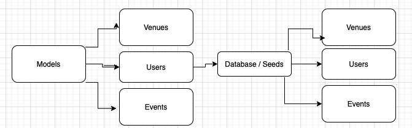
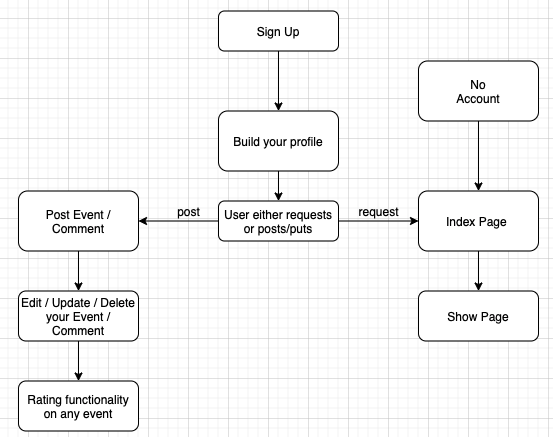
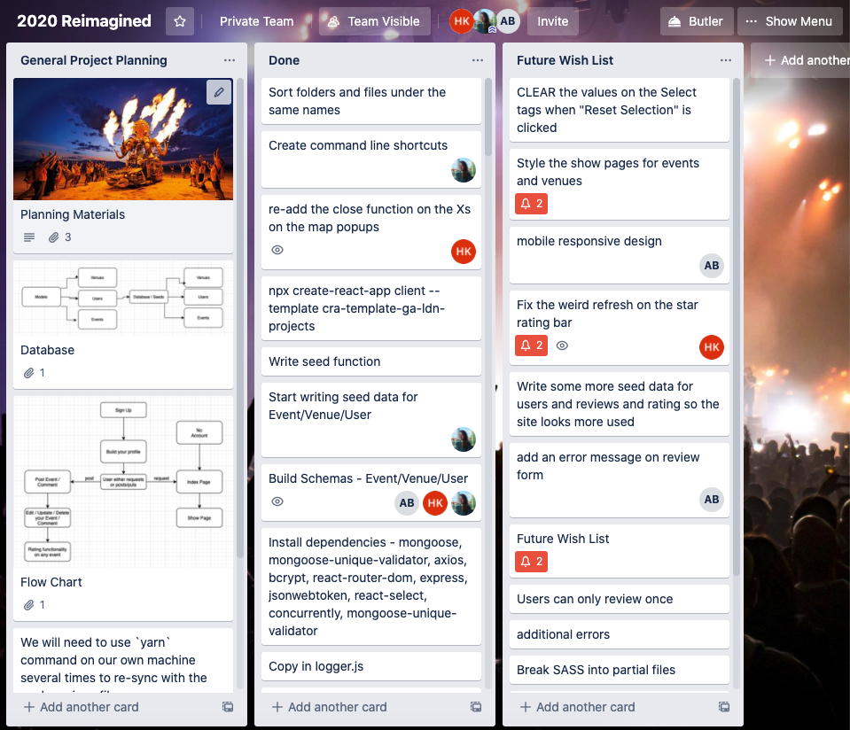

#  Project #3: 2020 Reimagined

# Brief
In your group, build a fullstack MERN application using your own RESTful API. Time-frame: 9 days.  

# Members

- Aislin Bamber - https://github.com/aislinb
- Penny Jungreis - https://github.com/penelopecj
- Hugo Kinahan - https://github.com/hugokinahan

# Deployment

Please follow the link to the website: 

# Motivation

With just 1 week of tuition in Node.js and Express we decided to challenge ourselves to build a highly functional app. As we were early into 2021 we decided to reflect on the troublesome year of 2020 as if COVID-19 were non-existent. Therefore, we build an events website for all the events in 2020 that were missed, into reimagined specatacles with thousands of visitors. 

# Preparation & Organisation

Backend Wireframe

Frontend Wireframe

Trello 

# Screenshots

Homepage

# Frameworks used

# Challenges

# Wins

  
# Future Features

