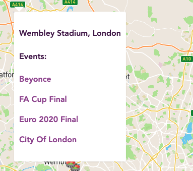

#  Project #3: 2020 Reimagined

# Brief
In your group, build a fullstack MERN application using your own RESTful API. Time-frame: 9 days.  

# Members

- Aislin Bamber - https://github.com/aislinb
- Penny Jungreis - https://github.com/penelopecj
- Hugo Kinahan - https://github.com/hugokinahan

# Deployment

Please follow the link to the website: https://project-3-2020-reimagined.herokuapp.com/
Repository - https://github.com/hugokinahan/sei-project-3

# Motivation

With just 1 week of tuition in Node.js and Express we decided to challenge ourselves to build a highly functional app. As we were early into 2021 we decided to reflect on the troublesome year of 2020 as if COVID-19 were non-existent. Therefore, we built an events website for all the events in 2020 that were missed, into reimagined specatacles with thousands of visitors. 

# Preparation & Organisation

Backend Wireframe


Frontend Wireframe


Trello 


# Frameworks used

- HTML5 
- CSS3 + SCSS
- JavaScript
  - ECMAScript6
  - React.js
  - Node.js
  - Express
  - MongoDB
- VSCode
- Axios
- Git + GitHub
- react-router-dom
- react-select
- react-hero-carousel
- react-spinners
- MapBox
- Cloudinary
- Insomnia
- Yarn
- Npm 

# Process

Backend

Working in a group of three had its challenges, but our group dynamic worked well to ensure we finished with the product we wanted. 

As we had over a week to do the project, we decided it best not to rush the backend, and miss some crucial elements. Therefore, we all worked on the backend together, often with one member of the team screen-sharing. This created an environment in which every member of the group knew the details of the backend, which came in especially useful when moving onto the React frontend. 

We created the data ourselves with events, venues and a handful of users. A typical event model looked like this:

```
  {
    name: 'Ed Sheeran', 
    date: '2020-01-04', 
    description: 'Armed with just a foot loop pedal, his guitar, his voice and a microphone, Sheeran captivated the audience for almost two hours. There is no debate that he is a talented live performer and can hold his own opposite a sold-out crowd of 39,000, however, in my eyes, the gig didn\'t reach its full potential.',
    eventImage: 'https://cdn.mysnapp.co.uk/images/original/ed-sheeran-has-broken-another-world-record-editorial-article-image-link-gP73.jpg',
    venueRef: 'Aviva Stadium'
  },
```

Using Node.js, Express and MongoDB in the backend was relatively new to the group, another reason why tackling this together would be rewarded later down the line. Pooling our knowledge here definitely helped our efficiency in completing our backend within 3 days. 

Frontend

After seeding the data, we were ready to move onto the React frontend. We implemented a basic style to which we could all work to and I set about creating a Mapbox feature to show all of the venues and events on the map (see map view below under screenshots). Using Mapbox I was able to create a popup to show all of the events listed at each venue, with a link to each event page. 

```
<ReactMapGL
              mapboxApiAccessToken={process.env.REACT_APP_MAPBOX_ACCESS_TOKEN}
              height="100%"
              width="100%"
              mapStyle='mapbox://styles/mapbox/streets-v11'
              {...viewport}
              onClick={() => setPopup(null)}
              onViewportChange={viewport => setViewport(viewport)}
            >
              {events ?
                events.map(event => (
                  <Marker
                    className='map-markers'
                    key={event.id}
                    latitude={event.venue.latitude}
                    longitude={event.venue.longitude}
                  >
                    <span
                      role="img"
                      aria-label="map-marker"
                      onClick={() => setPopup(event.venue)}
                    >
                    🏟
                    </span>
                  </Marker>
                ))
                :
                <div className="ring-loader">
                  <RingLoader color="purple" size={60} />
                </div>
              }
              {popup &&
          <Popup
            closeOnClick={true}
            latitude={popup.latitude}
            longitude={popup.longitude}
            closeButton={false}
          >
            <h4>{popup.name}, {popup.city}</h4>
            <h4>Events:</h4>
            <div>{events.map(event => {
              if (event.venue.name === popup.name) {
                return <p>
                  <Link to={`/events/${event._id}`}>{event.name}</Link>
                </p>
              }
            })}
            </div>
          </Popup>
              }
            </ReactMapGL>
```



While my group worked on the index pages and the show page for each event and venue. I took on the opportunity to build out the homepage, a crucial aspect to catch the eye of our users when they land on the site. I installed react-hero-carousel to implement a revolving hero image carousel set on a timer. I added an animated heading to the homepage to further enchance the appeal of the site, which I believe complemented the branding of the application. 

Lastly, I wanted to implement a Highest Rated Events section at the bottom of our homepage. If I had more time on this project I would go back and change the code here. As you can see below currently all events with an avgRating of higher than 4 would be listed here. Ideally, I would spend more time here to get the three highest rated events. 

```
  React.useEffect(() => {
    const getData = async () => {
      try {
        const { data } = await getAllEvents()
        const filteredEvents = data.filter(event => {
          const topThree = event.avgRating > 4
          return topThree
        })
        console.log(data)
        setEvents(filteredEvents)
      } catch (err) {
        console.log(err)
      }
    }
    getData()
  }, [])
```

We tackled the commenting on events and venues together as we knew this could prove a tricky task. We were able to get this implemented without too many issues. The remainder of the project was spent on styling to ensure we had continuity throughout the site. 

# Screenshots

Homepage


Index Page


Show Page


Map View


  
# Challenges

The most challenging aspect of this group project was the authorisation process, specifically when it came to logging in users. 

As you can see from the code snippet below we had to make checks to ensure that the user entered a valid password. I found using descriptive names useful to understand the flow of the loginUser function. If the user was successful, then using jwt they were issued with a token, the secret and a login expiry time of 7 days. 

```
async function loginUser(req, res, next) {
  try {
    const userToLogin = await User.findOne({ email: req.body.email })
    if (!userToLogin || !userToLogin.validatePassword(req.body.password)) {
      throw new Error(unauthorized)
    }
    const token = jwt.sign({ sub: userToLogin._id }, secret, { expiresIn: '7 days' })
    return res.status(202).json({ message: `Welcome back ${userToLogin.username}`, token })
  } catch (err) {
    next(err)
  }
}
```

# Wins

Using react-select we were able to include filters on the event index page to filter by Continent, Country and City. To do this it meant we had to create new functions, mapping and pushing the filtered element into an array. 

Below you can see the code snippet to filter by Continent. 

```
  const filteredContinents = []
  continents.map(continent => {
    filteredContinents.push({ value: continent, label: continent })
  })
```

```
  const handleSelectContinent = (e) => {
    const results = events.filter(event => {
      return event.venue.continent === e.value
    })
    setEvents(results)
  }
```

```
        <div>
          <Select 
            placeholder="Select a Continent..."
            options={filteredContinents}
            onChange={handleSelectContinent}
          />
        </div>
```

By implementing these three steps it meant, for example, that if Europe was selected it would not only filter out all other continents, but also leave only the countries in Europe for the Country filter. 

# Key Learnings

One of the most crucial aspects I learnt from this project was the planning. To my disadvantage, I hadn't spent too much time planning on Projects 1 & 2 but here we made a concerted effort not to begin with any coding until we were happy with our plan.  This involved building wireframes for user journeys and creating a Trello board to manage all of our tasks. Trello helped hugely when dividing up work between our group. We were clearly able to see who was working on what and what tasks there were still left to do. 

One aspect I think our group could have improved on was asking each other for help sooner. Occasionally we would spend too long on a task without asking for help, losing valuable time, when a group member could have helped out with added knowledge. 
  
# Future Features

If we had more time on this project we would add:

- Mobile Optimisation
- Create the ability to follow other users
- Add notifications for users
- Add recently added events feature

